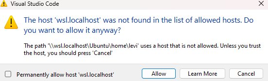
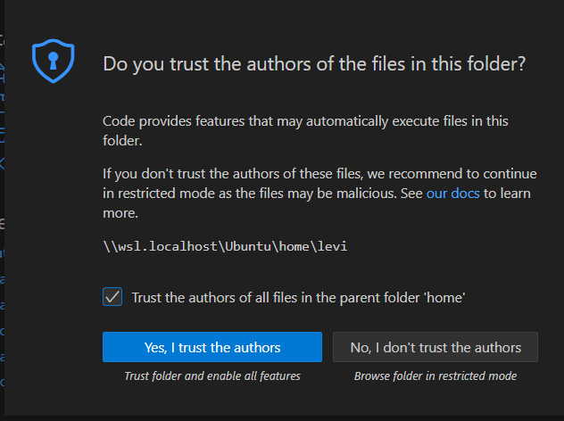
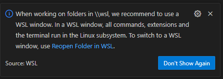
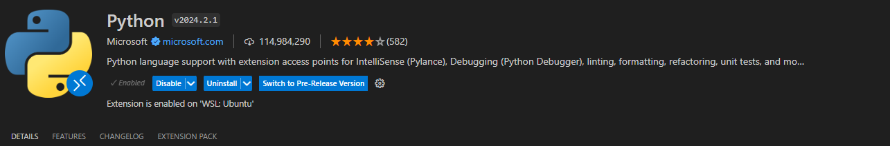
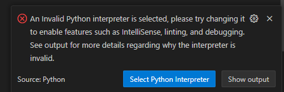

# Configure VSCODE
After the proper **Pyspark** installation in the previous step, we should set the vscode to be able to run spark from Ubunto.

# Ubunto
Open Ubunto and run:
- pyspark
- 

# Set Vscode
If you got the above image, everything is ready to set Vscode. So Let's do it.
- Open Vscode
- Go to File 
- Open folder
- type: \\\wsl.localhost\Ubuntu\home\
- At this point, you'll see a folder with your name or user, click on it.
- Select Folder.
- You may see some of the massages below, just accept them.
- You'll need to install the VsCode extension for python as showed below.
- You may need to change the python interpreter. Them choose the recommended.
- Open a new terminal in VsCode and run:
    - sudo apt install python3-pip (for pip installation)
    - pip install pyspark (for lib installation)
- 
- 
- 
- 
- 

So now we can move the **module_1**